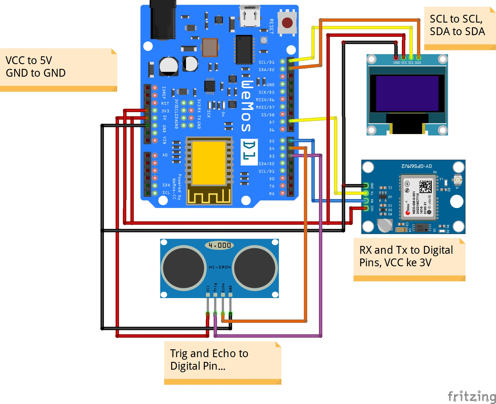
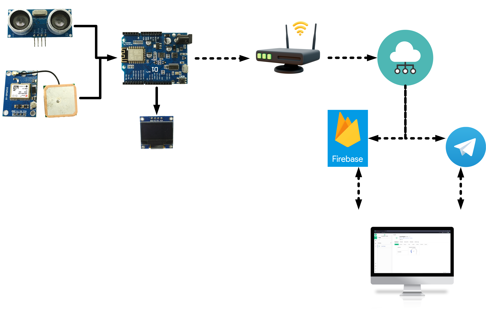

# Smart Trashbin with ESP8266, Firebase, and Telegram Bot

## PREFACE
This Smart-trashbin project is my 1st project of microcontroller by using firebase as a databse whre the data is sent to it, and telegram as a notification that is sent to janitor or someone else. it's just a prototype so the design might not be proper

this project is actually done to finish my study in 3rd year of college (5th semester)

## PURPOSE
This smart trashbin is to solve the problem that the janitors face everyday, just imagine if there's a janitor working in a big office with a lot of rooms, then the janitor should walk aroung and check whether the trashbin in a room is full or not. or for people who work in garbage truck and they go around the settlements and take household waste, but they go with no certainty whether the trashbin is full or not, or even the trashbin is in overcapacity... well, it really pissed them off, i guess..

## COMPONENTS
here's the component we need to build this project:
  1. **ESP8266**, I use Wemos D1 R1 for this project, you can use another dev board or microcontroller
  2. **Ultrasonic Sensor HC-SR04**, this sensor is to measure the capacity inside trashbin, you can use another if you know how it works
  3. **GPS Module Ublox NEO-6M**, it's actually optional, if you want the trashbin to be put outside
  4. **OLED Display 128x64**, it's also optional if you want to monitor the trashbin by offline, you can just use led as indicator.
  5. **Jumper Cable**

## Library I'm Using
  1. Firebase ESP8266 client, from https://github.com/mobizt/Firebase-ESP8266
  2. TinyGPS++, from https://github.com/mikalhart/TinyGPSPlus
  3. HCSR04, from https://github.com/gamegine/HCSR04-ultrasonic-sensor-lib or you can use another one, but don't forget to change the variable and function
  4. ArduinoJson ver. 5.13.5, from library manager by Benoit Blanchon
  5. Adafruit_GFX, from library manager by Adafruit
  6. Adafruit_SSD1306, from library manager by Adafruit
  7. CTBot ver. 2.1.9, from library manager by Stefano Ledda

Thanks for people who has shared powerful library...

## Image

## Thanks To
  1. The Libraries Developer
  2. My Friends  
    - Reza Fahlepi  
    - Bagas Martinus Rianu  
    - Arif Rakhman Charis  
    - Surya Ningsih  

## POST SCRIPT
you can just read the code, i have put the explanation there

